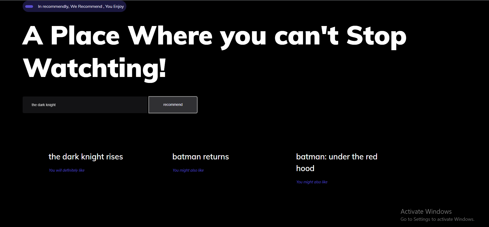

# -Recommendly-_intelligent-movie-recommendation-web-application

In this project I will build a web application which can recommend movies similar to your favorite movie based on the cosine similarity between movies overview.

Here is the folder structure,
* UI : This contains ui website code 
* server: Python flask server
* model: Contains python notebook for preprocessing data and model building 

Technologies used in this project,
1. Python
2. Numpy and Pandas for data cleaning
3. Sklearn for Natural Language Processing
7. Jupyter notebook, visual studio code and pycharm as IDE
8. Python flask for http server
9. HTML/CSS/Javascript for UI
